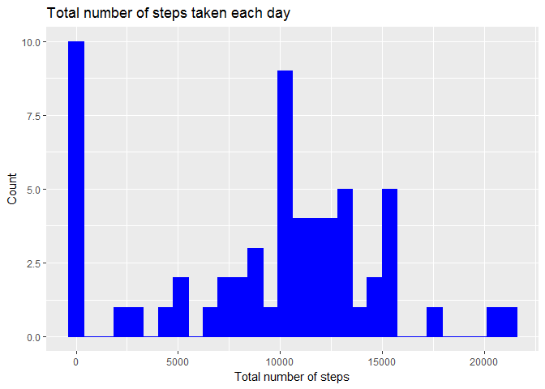
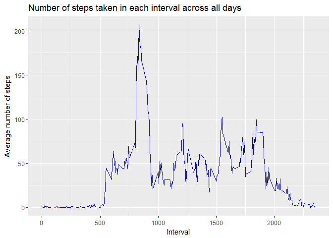
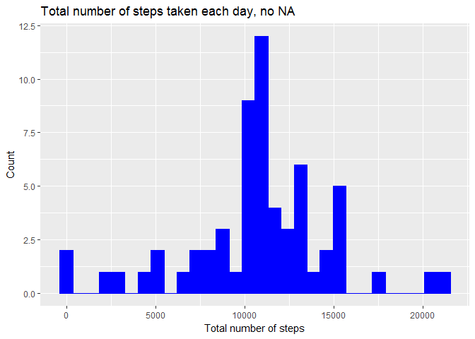
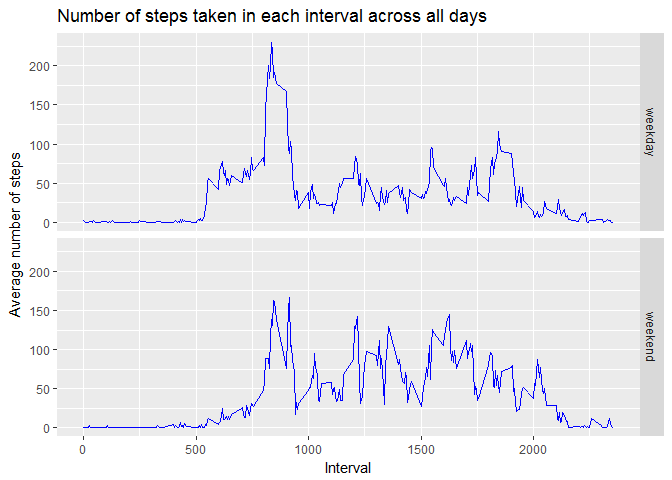

# Reproducible Research: Peer Assessment 1
## Introduction

This assignment makes use of data from a personal activity monitoring device. This device collects data at 5 minute intervals through out the day. The data consists of two months of data from an anonymous individual collected during the months of October and November, 2012 and include the number of steps taken in 5 minute intervals each day


## Prepare Workspace


```r
knitr::opts_chunk$set(echo = TRUE)
```


```r
library(scales)
library(dplyr)
```

```
## 
## Attaching package: 'dplyr'
```

```
## The following objects are masked from 'package:stats':
## 
##     filter, lag
```

```
## The following objects are masked from 'package:base':
## 
##     intersect, setdiff, setequal, union
```

```r
library(ggplot2)
```

**Set working directory**


```r
setwd("E:/M7md/Coursera/Projects/Reproducible Research/Project 1/RepData_PeerAssessment1")
```


## Loading and preprocessing the data
### Load dataset


```r
activitydf <- read.csv("activity.csv")
```

The variables included in this dataset are:

- steps: Number of steps taking in a 5-minute interval (missing values are coded as NA)

- date: The date on which the measurement was taken in YYYY-MM-DD format. There are 61 days in the dataset

- interval: Identifier for the 5-minute interval in which measurement was taken

### Structure of the data


```r
str(activitydf)
```

```
## 'data.frame':	17568 obs. of  3 variables:
##  $ steps   : int  NA NA NA NA NA NA NA NA NA NA ...
##  $ date    : Factor w/ 61 levels "2012-10-01","2012-10-02",..: 1 1 1 1 1 1 1 1 1 1 ...
##  $ interval: int  0 5 10 15 20 25 30 35 40 45 ...
```


```r
# Transform date into a date variable
activitydf$date <- as.Date(as.character(activitydf$date), format = "%Y-%m-%d")
class(activitydf$date)
```

```
## [1] "Date"
```


```r
# Check NAs
summary(activitydf) 
```

```
##      steps             date               interval     
##  Min.   :  0.00   Min.   :2012-10-01   Min.   :   0.0  
##  1st Qu.:  0.00   1st Qu.:2012-10-16   1st Qu.: 588.8  
##  Median :  0.00   Median :2012-10-31   Median :1177.5  
##  Mean   : 37.38   Mean   :2012-10-31   Mean   :1177.5  
##  3rd Qu.: 12.00   3rd Qu.:2012-11-15   3rd Qu.:1766.2  
##  Max.   :806.00   Max.   :2012-11-30   Max.   :2355.0  
##  NA's   :2304
```


```r
# There are NAs only in the step variable
sum(is.na(activitydf$steps))/length(activitydf$steps)
```

```
## [1] 0.1311475
```


## What is mean total number of steps taken per day?


```r
stepsbyday <- summarise(group_by(activitydf, date), sum(steps , na.rm = TRUE))
names(stepsbyday) <- c("date", "totalsteps")
stepsbyday
```

```
## # A tibble: 61 x 2
##          date totalsteps
##        <date>      <int>
##  1 2012-10-01          0
##  2 2012-10-02        126
##  3 2012-10-03      11352
##  4 2012-10-04      12116
##  5 2012-10-05      13294
##  6 2012-10-06      15420
##  7 2012-10-07      11015
##  8 2012-10-08          0
##  9 2012-10-09      12811
## 10 2012-10-10       9900
## # ... with 51 more rows
```

###Make a histogram of the total number of steps taken each day


```r
p1 <- ggplot(stepsbyday, aes(totalsteps)) + 
    geom_histogram(color="blue", fill="blue") + 
    scale_x_continuous(name = "Total number of steps") +
    scale_y_continuous(name = "Count") + 
    ggtitle("Total number of steps taken each day")
p1
```

```
## `stat_bin()` using `bins = 30`. Pick better value with `binwidth`.
```

<!-- -->

### Calculate and report the mean and median of the total number of steps taken per day


```r
# Total mean and median per day
summary(stepsbyday$totalsteps)
```

```
##    Min. 1st Qu.  Median    Mean 3rd Qu.    Max. 
##       0    6778   10395    9354   12811   21194
```


## What is the average daily activity pattern?

### Make a time series plot (i.e. type = "l") of the 5-minute interval (x-axis) and the average number of steps taken, averaged across all days (y-axis)


```r
stepsbyinterval <- summarise(group_by(activitydf, interval), 
                             mean(steps, na.rm = TRUE))

names(stepsbyinterval) <- c("interval", "meansteps")

p2 <- ggplot(stepsbyinterval, aes(interval, meansteps)) + 
    geom_line(color = "blue") +
    scale_x_continuous(name = "Interval") +
    scale_y_continuous(name = "Average number of steps") + 
    ggtitle("Number of steps taken in each interval across all days")

p2
```

<!-- -->

### Which 5-minute interval, on average across all the days in the dataset, contains the maximum number of steps?


```r
stepsbyinterval$interval[[which.max(stepsbyinterval$meansteps)]]
```

```
## [1] 835
```

## Imputing missing values

### Calculate and report the total number of missing values in the dataset


```r
summary(activitydf)
```

```
##      steps             date               interval     
##  Min.   :  0.00   Min.   :2012-10-01   Min.   :   0.0  
##  1st Qu.:  0.00   1st Qu.:2012-10-16   1st Qu.: 588.8  
##  Median :  0.00   Median :2012-10-31   Median :1177.5  
##  Mean   : 37.38   Mean   :2012-10-31   Mean   :1177.5  
##  3rd Qu.: 12.00   3rd Qu.:2012-11-15   3rd Qu.:1766.2  
##  Max.   :806.00   Max.   :2012-11-30   Max.   :2355.0  
##  NA's   :2304
```

### Devise a strategy for filling in all of the missing values in the dataset.

Using the mean for that 5-minute interval to impute missing values


```r
## Copy the steps variable (keeping the original one as control)
activitydf$steps2 <- activitydf$steps

# Add column with the mean step values per interval
activitydf <- merge(activitydf, stepsbyinterval, 
                    by.x = "interval", by.y = "interval" , 
                    all.x = TRUE, all.y = FALSE
                    )

activitydf <- arrange(activitydf, date, interval)

# Fill NA values with the mean step values for that interval
activitydf$steps2[is.na(activitydf$steps)] <- activitydf$meansteps[is.na(activitydf$steps)]
```

### Create a new dataset that is equal to the original dataset but with the missing data filled in.


```r
activitydf2 <- transmute(activitydf, 
                         date = date, 
                         interval = interval,
                         steps = steps2)
```

### Make a histogram of the total number of steps taken each day


```r
stepsbyday2 <- summarise(group_by(activitydf2, date), sum(steps))
names(stepsbyday2) <- c("date", "sumsteps")
p3 <- ggplot(stepsbyday2, aes(sumsteps)) +
    geom_histogram(fill = "blue", color = "blue") +
    scale_x_continuous(name = "Total number of steps") +
    scale_y_continuous(name = "Count") + 
    ggtitle("Total number of steps taken each day, no NA")
p3
```

```
## `stat_bin()` using `bins = 30`. Pick better value with `binwidth`.
```

<!-- -->

### Calculate and report the mean and median total number of steps taken per day.


```r
summary(stepsbyday2)
```

```
##       date               sumsteps    
##  Min.   :2012-10-01   Min.   :   41  
##  1st Qu.:2012-10-16   1st Qu.: 9819  
##  Median :2012-10-31   Median :10766  
##  Mean   :2012-10-31   Mean   :10766  
##  3rd Qu.:2012-11-15   3rd Qu.:12811  
##  Max.   :2012-11-30   Max.   :21194
```

### Do these values differ from the estimates from the first part of the assignment? What is the impact of imputing missing data on the estimates of the total daily number of steps?

The values are different. Imputing missing data increased slightly the median. The increment in mean was larger. Looking at the summary statistics, the biggest difference was between the values for the first and second quartile. The third and fourth quartile are identical.


## Are there differences in activity patterns between weekdays and weekends?

### Create a new factor variable in the dataset with two levels - "weekday" and "weekend" indicating whether a given date is a weekday or weekend day.


```r
weekdayname <- weekdays(activitydf2$date)
weekday <- ifelse(
                  grepl("^S.+$", weekdayname, perl = TRUE),
                  gsub("^S.+$", "weekend", weekdayname, perl = TRUE),
                  gsub("^.+$", "weekday", weekdayname, perl = TRUE)
           )

activitydf2$weekday <- factor(weekday, levels = c("weekday", "weekend")) 
```

### Make a panel plot containing a time series plot (i.e. ???????????????? = "????") of the 5-minute interval (x-axis) and the average number of steps taken, averaged across all weekday days or weekend days (y-axis).

See the README file in the GitHub repository to see an example of what this plot should look like using simulated data.


```r
stepsbyinterval2 <- summarise(group_by(activitydf2, interval, weekday), 
                             mean(steps, na.rm = TRUE))

names(stepsbyinterval2) <- c("interval", "weekday","meansteps")

p4 <- ggplot(stepsbyinterval2, aes(interval, meansteps)) + 
    geom_line(color = "blue") +
    scale_x_continuous(name = "Interval") +
    scale_y_continuous(name = "Average number of steps") + 
    ggtitle("Number of steps taken in each interval across all days") +
    facet_grid(weekday ~ .)
p4
```

<!-- -->
